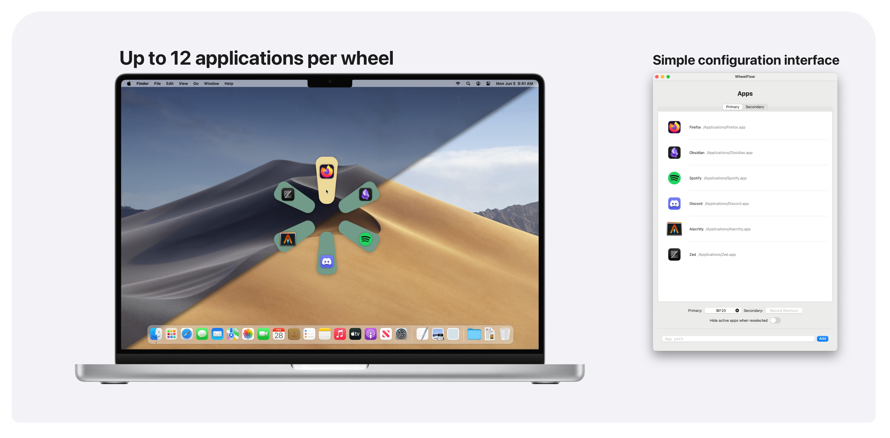

# WheelFlow

**WheelFlow** is an intuitive circular application launcher designed to be seamless and straightforward, allowing you to focus on what you need to do without getting in your way. 

Opening apps with WheelFlow is super fast - simply trigger the customizable shortcut, hover over the app-slice you wish to open, and release the shortcut to launch your desired application. The WheelFlow interface will follow your mouse and automatically position itself so that no matter where your mouse is, you can consistently open the same app with a familiar flicking gesture.